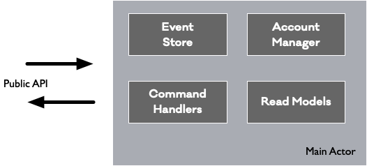

# CQRS based bank example application
This project is an example to translate the CQRS pattern into internet computer development.

## Use Case
We are creating a simple bank account example with the following specifications:

* `Create Accunt` - Allows to create a new account into the system.
* `Deposit` - Add money to a specific account.
* `Withdraw` - Remove money from a specific account. On the other hand, the systema has some kind of Fidelity refund of 1% when users spend money from their accounts. 
* `Get Account Information` - Returns all the user information and current balance
* `Get Account Ledger` - Returns all account movements

## Architecture
As we are following the CQRS pattern, we are going to have the following commands:
1. `CreateAccount(accountNumber: Nat, name: Text, Surname:Text)`
2. `deposit(accountNumber: Nat, amount: Float)`
3. `withdraw(accountNumber: Nat, amount: Float)`

In terms of read-models we are going to have the following data projections:
1. `getAccount(accountNumber: Nat)`
2. `getAllLedgers()`
3. `getAccountLedger(accountNumber: Nat)`
4. `getTotalFidelityRefundForAccount(accountNumber: Nat)`

Internally the application is following this architecture:



The application has a main actor that keeps a reference to all classes and also coordinates all the work. The command handler class has all the logic related with commands. The event store provides the storage for all events and also all the event handlers for each type of event. The Account Manager is a class that maintain updated state of all accounts, it can be considered as a cached version of the current state of the application. Finally the read models contains all the neccesary logic to create the different data projections.  
## Data path
As the application is following the CQRS pattern, the following Data paths are used:


Let's start with the write part of the CQRS pattern. When a new command arrives into the system, the command handler is going to perform some validations and if all of them are correct the command handler is going to create a new event. The new event is processed by the event store and it execute all the user logic associated with that particular event and also the event store is going to update the account manager to update the current state of the account.  

In term of the Read part side of the CQRS pattern. When a new read model request is received the readmodels are going to query the event store and/or the account manager to get the neccesary information. Apart from that the readmodel is also in charge of adapt the way that the data are presented to the user. 

## Deploy and test the application
To deploy the application locally simply execute: `dfx deploy`
In order to test the application, here are some output examples:

```sh
➜ dfx canister call bank createAccount '(1,"Joe","Peralta")'  
()
➜ dfx canister call bank deposit '(1, 300.0)'               
()
➜ dfx canister call bank withdraw '(1, 25.0)'
(true)
➜ dfx canister call bank getAccount 1                      
(
  opt record {
    balance = 275.25;
    name = "Joe";
    surname = "Peralta";
    accountNumber = 1;
  },
)
➜ dfx canister call bank getAccountLedger 1
(
  vec {
    record {
      timestamp = 1_623_022_974_948_996_000;
      accountNumber = 1;
      eventType = variant {
        accountCreated = record {
          balance = 0;
          name = "Joe";
          surname = "Peralta";
          accountNumber = 1;
        }
      };
    };
    record {
      timestamp = 1_623_023_052_946_335_000;
      accountNumber = 1;
      eventType = variant { depositDone = 300 };
    };
    record {
      timestamp = 1_623_023_065_947_644_000;
      accountNumber = 1;
      eventType = variant { withdrawDone = 25 };
    };
    record {
      timestamp = 1_623_023_065_947_644_000;
      accountNumber = 1;
      eventType = variant { fidelityRefundDone = 0.25 };
    };
  },
)
```